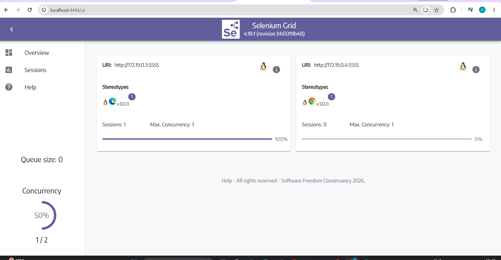
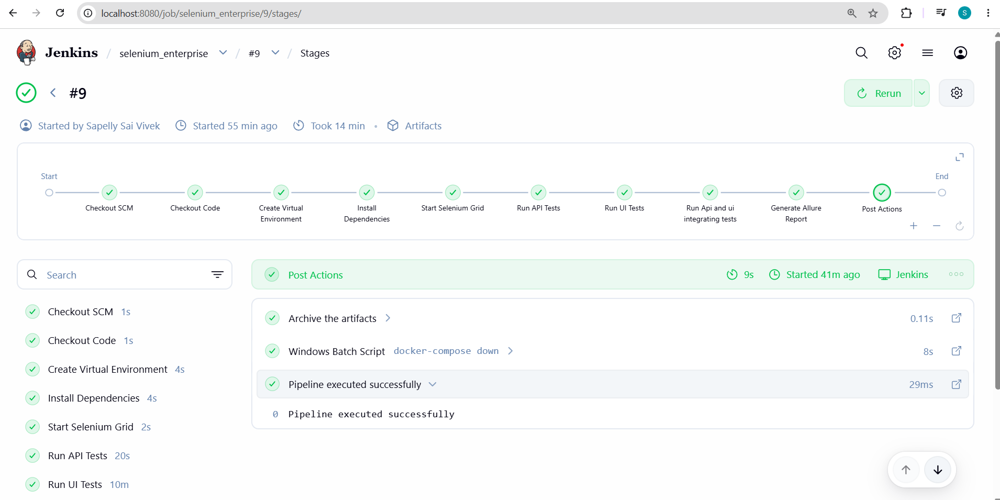
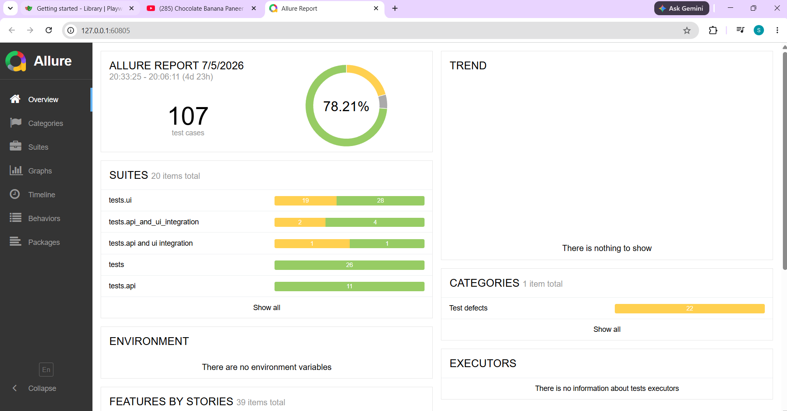

# Enterprise Test Automation Framework
### Selenium + Pytest + API Testing + Jenkins + Docker + Selenium Grid + Allure + AI Self-Healing

An enterprise-level automation framework built using **Python**, **Pytest**, **Selenium WebDriver**, and **REST API Testing**.

The framework follows the **Page Object Model (POM)** architecture and integrates modern automation practices such as parallel execution, Selenium Grid, AI-powered locator healing, Jenkins CI/CD, Docker, and Allure Reporting.

---

# Features

- UI Automation using Selenium
- REST API Automation
- API + UI Integration Testing
- Page Object Model (POM)
- Selenium Grid Execution
- Docker Support
- Parallel Test Execution
- Jenkins CI/CD Pipeline
- Allure Reports
- HTML Reports
- AI Self-Healing Locators
- Automatic Screenshot Capture
- Logging
- Retry Failed Tests
- Cross Browser Testing
- Environment Configurations

---

# Tech Stack

| Technology | Usage |
|------------|------|
| Python | Programming Language |
| Pytest | Test Framework |
| Selenium | UI Automation |
| Requests | API Testing |
| Docker | Containerization |
| Selenium Grid | Distributed Testing |
| Jenkins | Continuous Integration |
| Allure | Test Reporting |
| Pytest-xdist | Parallel Execution |
| Pytest-rerunfailures | Retry Failed Tests |
| BeautifulSoup | DOM Parsing |
| OpenAI | AI Locator Healing |

---

# Project Structure

```
.
├── ai/
│   ├── locator_healer.py
│   ├── dom_parser.py
│   └── healing_prompt.py
│
├── config/
│
├── fixtures/
│
├── pages/
│
├── reports/
│
├── tests/
│   ├── ui/
│   ├── api/
│   └── api_and_ui_integration/
│
├── utils/
│
├── Jenkinsfile
├── docker-compose.yml
├── requirements.txt
└── README.md
```

---

# Framework Architecture

```
Pytest
   │
   ▼
Fixtures
   │
   ▼
Page Objects
   │
   ▼
Selenium Grid
   │
   ▼
Chrome / Edge Containers

API Tests
   │
   ▼
Requests Library

Results
   │
   ▼
Allure Reports
   │
   ▼
Jenkins
```

---

# Installation

Clone the repository

```bash
git clone https://github.com/sapellysaivivek/T6A_Automation_capstone_project.git
```

Move into project

```bash
cd T6A_Automation_capstone_project
```

Create Virtual Environment

```bash
python -m venv venv
```

Activate

Windows

```bash
venv\Scripts\activate
```

Linux

```bash
source venv/bin/activate
```

Install dependencies

```bash
pip install -r requirements.txt
```

---

# Start Selenium Grid

```bash
docker compose up -d
```

Open Selenium Grid

```
http://localhost:4444/ui
```

---

# Run Tests

Run all tests

```bash
pytest
```

Run UI Tests

```bash
pytest tests/ui
```

Run API Tests

```bash
pytest tests/api
```

Run Integration Tests

```bash
pytest tests/api_and_ui_integration
```

Parallel Execution

```bash
pytest -n auto
```

Retry Failed Tests

```bash
pytest --reruns 2 --reruns-delay 5
```

Generate Allure Results

```bash
pytest --alluredir=allure-results
```

View Report

```bash
allure serve allure-results
```

---

# Jenkins Pipeline

The project includes a complete Jenkins pipeline that performs:

- Checkout from GitHub
- Create Virtual Environment
- Install Dependencies
- Start Selenium Grid
- Execute Tests
- Generate Allure Results
- Archive Reports

Pipeline stages

```
Checkout
      │
      ▼
Install Dependencies
      │
      ▼
Docker Selenium Grid
      │
      ▼
Execute Tests
      │
      ▼
Generate Allure Report
      │
      ▼
Archive Results
```

---

# AI Self-Healing

The framework includes an AI-powered locator healing mechanism.

If an element locator fails,

- DOM is analyzed
- Alternative locators are generated
- Test retries automatically using healed locators

This reduces failures caused by minor UI changes.

---

# Reporting

The framework supports

- Allure Reports
- Pytest HTML Reports
- Console Logs
- Screenshots on Failure

---
# Screenshots

## Selenium Grid



---

## Jenkins Pipeline



---

## Allure Report



# Test Categories

- UI Tests
- API Tests
- API + UI Integration Tests
- Cross Browser Tests
- Parallel Execution Tests

---

# Future Improvements

- GitHub Actions
- Slack Notifications
- Email Reporting
- Database Validation
- Performance Testing
- Mobile Automation
- Kubernetes Execution

---

# Author

**Sapelly Sai Vivek**

GitHub

https://github.com/sapellysaivivek


